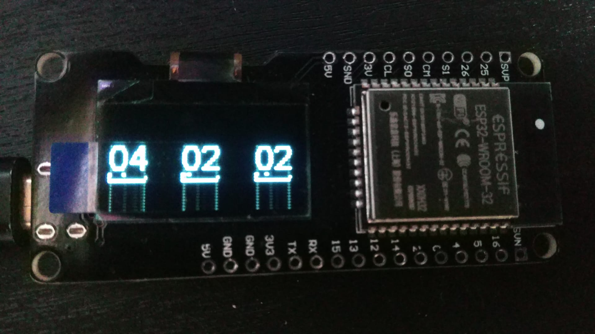

# ESP32 Display
# Use Case
I´ve first tried to develop this code when i wanted to monitor my house consumption and be on top of my solar production also..
A note my house has a 3 phase connection so i hace a 3 phase inverter installed.
Displaying the information in real time can give me an edge on when or what phase of the house can i use some electronic device
to better manage my electric bill.
Getting the information on my web server was cool but live information is beter so the code got developed.
# Features
It has 3 phases displayed with a status bar below showing the decimals of the number. (pretty cool look)
#Too develop
I will probably develop next a 3D casing for the ESP32 for extra looks.
But for now it will do
# Image
PS:don´t mind the vetical lines on the numbers, the screen got broken on shipping.
 	
# Enjoy!
